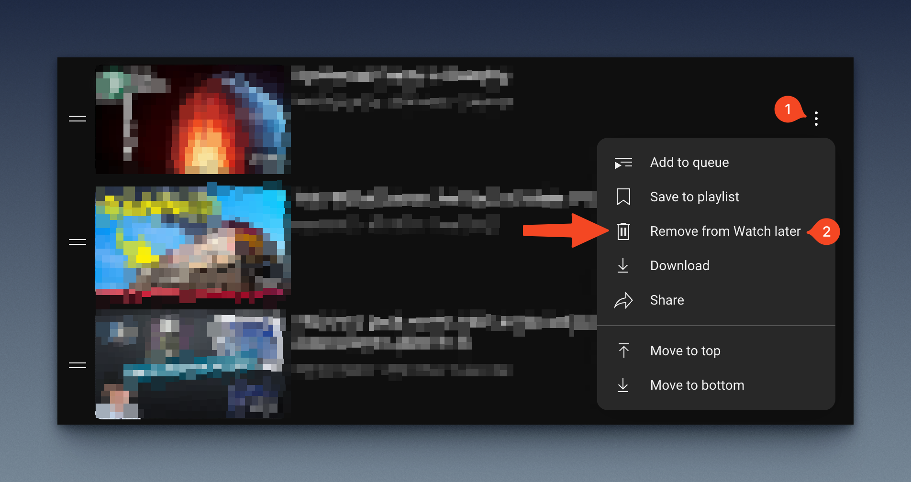
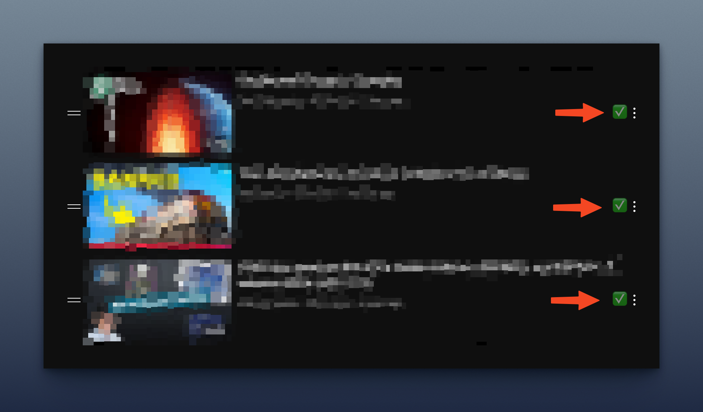

# Watched! - Buttons to remove videos from 'Watch Later' playlist

Make the Watch Later list a bit easier to use.

## Before: 2 steps

## After: 1 step

## Manual Install

### Edge

1. Download repo
2. Unzip
3. Go to `edge://extensions/`
4. Enable Developer Mode
5. Click `Load Unpacked`
6. Select the `src` folder

### Other browsers
I dunno, sorry. 

Maybe the docs from the original author of the package I used can help you:
https://github.com/lozog/not-interested-youtube

## Credits!!
Based on a similar repository:
https://github.com/lozog/not-interested-youtube