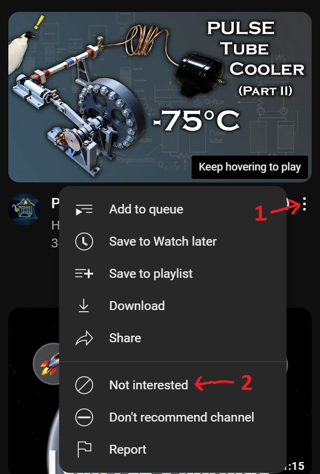
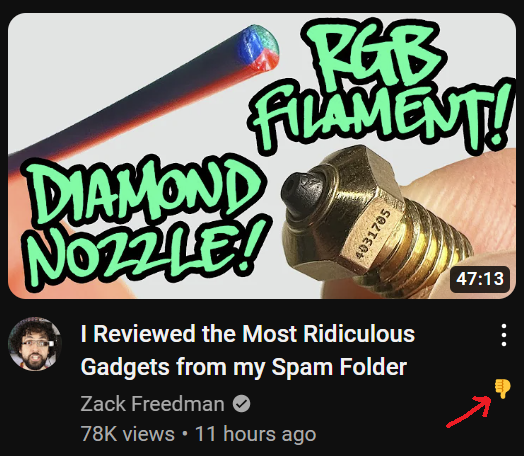

# **Nah - Youtube Not Interested Button**

Tell Youtube in one click this video or channel is not interesting.

[Install for Firefox](https://addons.mozilla.org/en-US/firefox/addon/youtube-not-interested-button/)  
[Install for Chrome](https://chromewebstore.google.com/detail/nah/jlceoenebonplbmbdmpcmjipmnhbpema)

## **Before: 2 steps**

## **after: 1 step**

## Manual Install

### Firefox

1. Zip the contents of the `src/` folder
1. Navigate to `about:debugging#/runtime/this-firefox`
1. Click `Load Temporary Add-on...` button
1. Select the `zip` file created in step 1

### Chrome

1. Checkout the `master-chrome` branch
1. Navigate to chrome://extensions
1. Click Load unpacked button
1. Select src/ folder path
